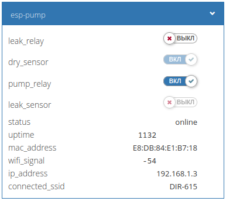
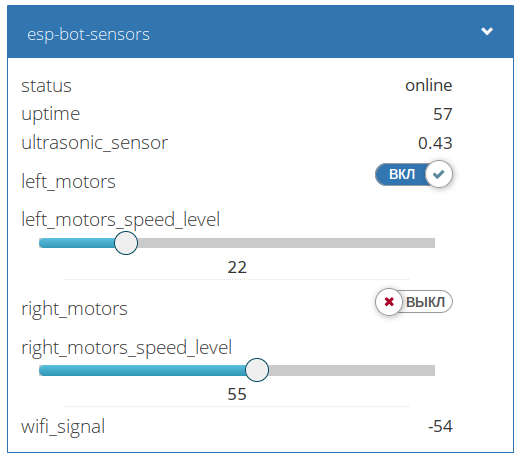

# esphome2wb
## Описание
Конвертер mqtt-топиков ESPHome в нотацию Wiren Board

Поддерживает контролы:
- switch
- binary_sensor
- text_sensor
- sensor
- fan
- speed_level
- контролы с JSON будут представлены в виде редактируемой строки — это позволит обработать их в правилах или в отредактировать вручную.

Дочерние контролы преобразуются в контролы верхнего уровня, а название составляется из имени родителя и дочернего контрола по формуле: "parent_child".

[Список изменений в версиях](./doc/changelog.txt)




## Настройка MQTT в прошивке ESPHome

Добавьте в файл конфигурации прошивки строки:
```yaml
substitutions:
  name: "my_device"
  prefix: "esphome/${name}" 
  
esphome:
  name: ${name}
  platform: ESP8266
  board: your-board
##
# Настройки Wi-Fi и других сервисов
##

# Настройки подключения к MQTT-брокеру
mqtt:
  broker: 192.168.1.0 # укажите IP-адрес контроллера
  port: 1883
  username: ''
  password: ''
  discovery: false
  id: mqtt_client
  topic_prefix: "${prefix}"  

# Передача статуса в MQTT
  birth_message:
      topic: "${prefix}/text_sensor/status/state"
      payload: online

  will_message:
      topic: "${prefix}/text_sensor/status/state"
      payload: offline

  shutdown_message :
      topic: "${prefix}/text_sensor/status/state"
      payload: shutdown

```

## Настройка в контроллере Wiren Board
Положите файл **esphome2wb.js** в папку `/etc/wb-rules/` или создайте в веб-интерфейсе контроллера новый скрипт и вставьте в него содержимое этого файла.

Всё, теперь все устройства с прошивкой ESPHome, которые подключаются к MQTT-брокеру контроллера автоматически появятся на вкладке **Devices**.
